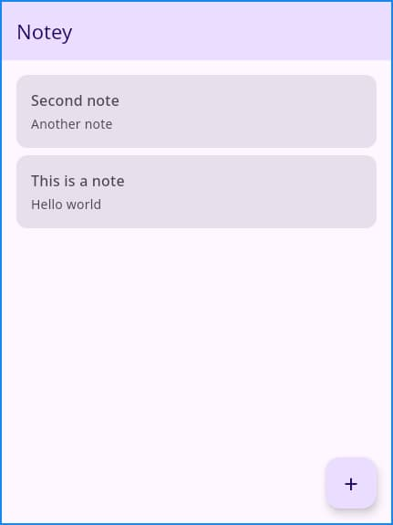

<div align = "center">

<h1><a href="https://github.com/2kabhishek/Notey">Notey</a></h1>

<a href="https://github.com/2KAbhishek/Notey/blob/main/LICENSE">
 </a>

<a href="https://github.com/2KAbhishek/Notey/graphs/contributors">
 </a>

<a href="https://github.com/2KAbhishek/Notey/stargazers">
</a>

<a href="https://github.com/2KAbhishek/Notey/network/members">
 </a>

<a href="https://github.com/2KAbhishek/Notey/watchers">
 </a>

<a href="https://github.com/2KAbhishek/Notey/pulse">
 </a>

<h3>Note taking with KMP 📝📱</h3>

<figure>
  
  <br/>
  <figcaption>Notey in action</figcaption>
</figure>

</div>

Notey is a Kotlin Multiplatform note-taking app that allows users to create, edit, delete, and persist local notes across Android, iOS, and desktop systems.

## ✨ Features

- Create, edit, and delete notes
- Persist notes locally with Room KMP and SQLite
- Shared Compose Multiplatform UI for Android, iOS, and desktop
- Localized app strings for English, Spanish, and Hindi
- Gradle tasks for Android, JVM desktop, iOS simulator, and physical iOS device workflows

## ⚡ Setup

### ⚙️ Requirements

- JDK 21
- Android SDK with API 36 for Android builds
- Xcode for iOS builds
- Android emulator/device or iOS simulator/device for running platform apps

### 💻 Installation

Installing Notey is as simple as cloning and running the verification task.

```bash
git clone git@github.com:2KAbhishek/Notey.git
cd Notey
./gradlew :composeApp:checkAll
```

## 🚀 Usage

```bash
USAGE:
    ./gradlew <task> [OPTIONS]

Examples:
    ./gradlew :composeApp:assembleDebug
    ./gradlew :composeApp:run
    ./gradlew iosSimulatorRun -PiosSimulatorId=<simulator-udid>
    ./gradlew iosDeviceRun -PiosDeviceId=<device-udid>
```

Helpful iOS device lookup commands:

```bash
xcrun simctl list devices available
xcrun xctrace list devices
```

## 🏗️ What's Next

Planning to add search, note timestamps, sorting, share-to-app support, and Markdown export.

### ✅ To-Do

- [x] Build core note CRUD flow
- [x] Add Room KMP persistence
- [x] Add Android, iOS, and desktop targets
- [ ] Add search and sort options
- [ ] Add Markdown export

## 🧑‍💻 Behind The Code

### 🌈 Inspiration

Notey was inspired by the need for a small real-world app to learn Kotlin Multiplatform development and to experiment with.

### 💡 Challenges/Learnings

- The main challenges were aligning Kotlin, Compose Multiplatform, KSP, Room KMP, and native iOS build tooling.
- I learned about shared Compose UI, Room database generation across KMP targets, expect/actual platform boundaries, and Gradle task wiring for iOS workflows.

### 🧰 Tooling

- [Kotlin Multiplatform](https://kotlinlang.org/docs/multiplatform.html) — Shared Kotlin codebase
- [Compose Multiplatform](https://www.jetbrains.com/lp/compose-multiplatform/) — Shared UI toolkit
- [Room](https://developer.android.com/kotlin/multiplatform/room) — Local persistence
- [Gradle](https://gradle.org/) — Build automation
- [Xcode](https://developer.apple.com/xcode/) — iOS shell app builds

<hr>

<div align="center">

<strong>⭐ hit the star button if you found this useful ⭐</strong><br>

<a href="https://github.com/2KAbhishek/Notey">Source</a>
| <a href="https://2kabhishek.github.io/blog" target="_blank">Blog </a>
| <a href="https://twitter.com/2kabhishek" target="_blank">Twitter </a>
| <a href="https://linkedin.com/in/2kabhishek" target="_blank">LinkedIn </a>
| <a href="https://2kabhishek.github.io/links" target="_blank">More Links </a>
| <a href="https://2kabhishek.github.io/projects" target="_blank">Other Projects </a>

</div>
