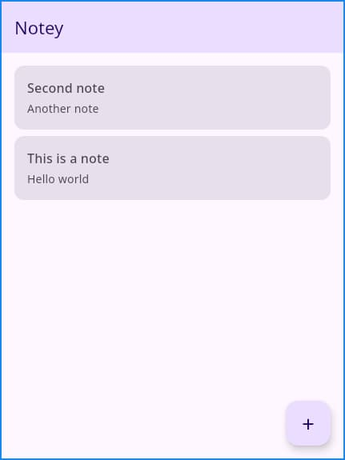

<div align = "center">

<h1><a href="https://github.com/2kabhishek/Notey">Notey</a></h1>

<a href="https://github.com/2KAbhishek/Notey/blob/main/LICENSE">
 </a>

<a href="https://github.com/2KAbhishek/Notey/graphs/contributors">
 </a>

<a href="https://github.com/2KAbhishek/Notey/stargazers">
</a>

<a href="https://github.com/2KAbhishek/Notey/network/members">
 </a>

<a href="https://github.com/2KAbhishek/Notey/watchers">
 </a>

<a href="https://github.com/2KAbhishek/Notey/pulse">
 </a>

<h3>Note taking with KMP 📝📱</h3>

<figure>
  
  <br/>
  <figcaption>Notey in action</figcaption>
</figure>

</div>

Notey is a Kotlin Multiplatform note-taking app that allows users to create, edit, delete, and persist local notes across Android, iOS, desktop, and web (Wasm & JS).

## ✨ Features

- Create, edit, and delete notes
- Persist notes locally with Room KMP (SQLite) on Android, iOS, & desktop, and `localStorage` on Web
- Shared Compose Multiplatform UI across all supported platforms
- Localized app strings for English, Spanish, Hindi, and Chinese (Simplified & Traditional)
- Gradle tasks for Android, JVM desktop, iOS simulator, physical iOS device, and Web workflows

## ⚡ Setup

### ⚙️ Requirements

- JDK 21
- Android SDK with API 36 for Android builds
- Xcode for iOS builds
- Node.js and a modern browser (Chrome, Edge, Firefox, Safari) for Web builds
- Android emulator/device, iOS simulator/device, or browser for running platform apps

### 💻 Installation

Installing Notey is as simple as cloning and running the verification task.

```bash
git clone git@github.com:2KAbhishek/Notey.git
cd Notey
./gradlew :composeApp:checkAll
```

## 🚀 Running the App

### 📱 Android

Build and install on a connected device or emulator:

```bash
./gradlew :composeApp:installDebug
```

Or assemble the APK:

```bash
./gradlew :composeApp:assembleDebug
```

### 🍎 iOS

Run on iOS Simulator:

```bash
./gradlew iosSimulatorRun -PiosSimulatorId=<simulator-udid>
```

Run on a connected physical iPhone:

```bash
./gradlew iosDeviceRun -PiosDeviceId=<device-udid>
```

Helpful iOS device lookup commands:

```bash
xcrun simctl list devices available
xcrun xctrace list devices
```

### 🖥️ Desktop (JVM)

```bash
./gradlew :composeApp:run
```

### 🌐 Web (Wasm & JS)

Run the Wasm version in the browser:

```bash
./gradlew :composeApp:wasmJsBrowserDevelopmentRun
```

Run the JavaScript version in the browser:

```bash
./gradlew :composeApp:jsBrowserDevelopmentRun
```

Or build production web bundles:

```bash
./gradlew :composeApp:wasmJsBrowserDistribution
./gradlew :composeApp:jsBrowserDistribution
```

## 🏗️ What's Next

Planning to add search, note timestamps, sorting, share-to-app support, and Markdown export.

### ✅ To-Do

- [x] Build core note CRUD flow
- [x] Add Room KMP persistence (Android, iOS, Desktop)
- [x] Add Web (Wasm and JS) targets with `localStorage` persistence
- [x] Add Android, iOS, desktop, and Web targets
- [ ] Add search and sort options
- [ ] Add Markdown export

## 🧑‍💻 Behind The Code

### 🌈 Inspiration

Notey was inspired by the need for a small real-world app to learn Kotlin Multiplatform development and to experiment with.

### 💡 Challenges/Learnings

- The main challenges were aligning Kotlin, Compose Multiplatform, KSP, Room KMP, and native iOS build tooling.
- I learned about shared Compose UI, Room database generation across KMP targets, expect/actual platform boundaries, and Gradle task wiring for iOS workflows.

### 🧰 Tooling

- [Kotlin Multiplatform](https://kotlinlang.org/docs/multiplatform.html) — Shared Kotlin codebase
- [Compose Multiplatform](https://www.jetbrains.com/lp/compose-multiplatform/) — Shared UI toolkit
- [Room](https://developer.android.com/kotlin/multiplatform/room) — Local persistence
- [Gradle](https://gradle.org/) — Build automation
- [Xcode](https://developer.apple.com/xcode/) — iOS shell app builds

<hr>

<div align="center">

<strong>⭐ hit the star button if you found this useful ⭐</strong><br>

<a href="https://github.com/2KAbhishek/Notey">Source</a>
| <a href="https://2kabhishek.github.io/blog" target="_blank">Blog </a>
| <a href="https://twitter.com/2kabhishek" target="_blank">Twitter </a>
| <a href="https://linkedin.com/in/2kabhishek" target="_blank">LinkedIn </a>
| <a href="https://2kabhishek.github.io/links" target="_blank">More Links </a>
| <a href="https://2kabhishek.github.io/projects" target="_blank">Other Projects </a>

</div>
